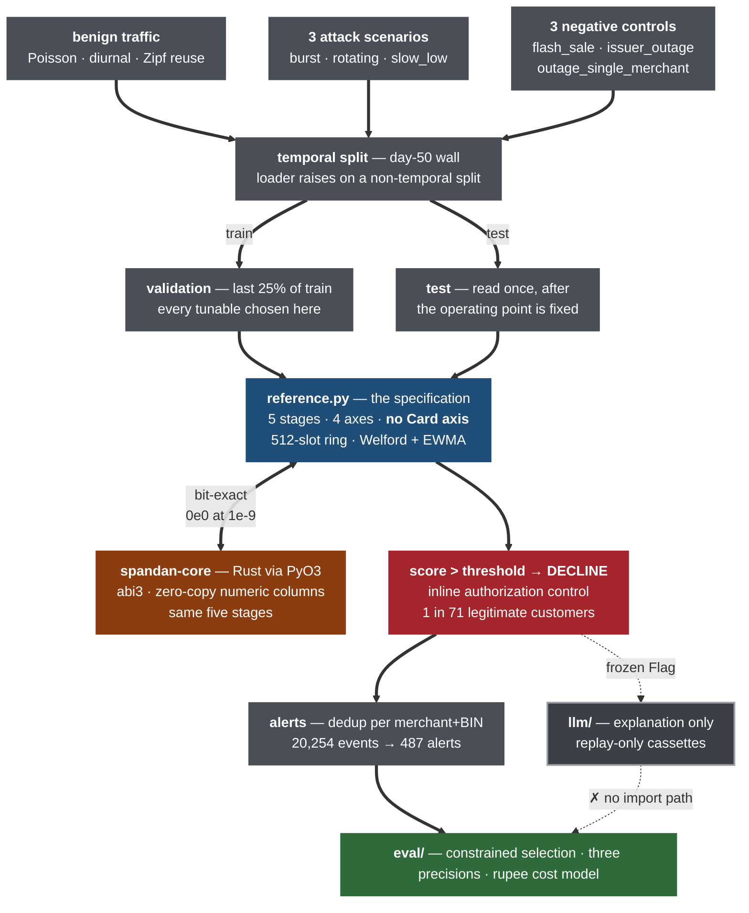
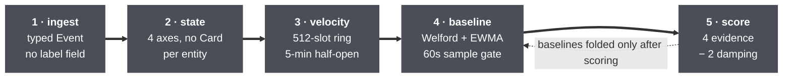

# Spandan

A deterministic streaming detector for card-testing and velocity abuse on card
authorization traffic, with a Rust core, a bit-exact Python reference, and an
evaluation harness that prices its own false positives in rupees.

## The problem

Stolen card numbers are worthless until someone knows which ones still work. The
cheapest way to find out is to attempt a small authorization and read the response,
so a merchant's checkout gets used as a liveness oracle: a run of low-value
attempts, mostly declined, concentrated on a few issuing BINs, arriving faster than
that merchant's real customers. No single attempt is anomalous — the rate and the
concentration are. Merchants pay for this in scheme chargeback ratios, in
authorization-abuse penalties, and in the downstream fraud on whichever cards came
back approved.

Spandan scores each authorization attempt against per-entity baselines it learns
from the stream, and **a flag declines the transaction** — it is an inline
authorization control, not a notification. Alerts are the human-facing grouping of
those declines per (merchant, BIN), not a softer separate action.

## Results

Median across three independently generated 100-day streams (1.61M events, 240
attack and control episodes). Threshold selected on validation only, under an
alerts/day budget fixed before the test window was read. Ranges in
[docs/FAILURE_MODES.md](docs/FAILURE_MODES.md) §0.

| metric | value |
|---|---|
| **precision @ 0.15% base rate** | **0.0824** — eleven false alarms per true catch |
| **legitimate transactions declined** | **1.41%, or 1 in 71** |
| precision @ generator's 1.33% rate | 0.4462 |
| alert-level precision | 0.433 (211 real of 487 alerts) |
| recall (event-level) | 0.8444 |
| episodes detected | 60/60 |
| events to first flag (p90) | burst 32 · rotating 6 · slow_low 7 |
| PR-AUC | 0.6615 |
| share of all traffic flagged | 2.52% |
| net position, rupee cost model | ₹348,845 (range ₹279,151–₹395,007) |
| break-even review cost | ₹613 per alert |
| streaming throughput / p99 (Rust) | 199,925 events/s / 11.6µs |

Precision at the 0.15% base rate leads because the generator's own positive rate is
about ten times a realistic merchant rate, and quoting 0.4462 flatters the detector
by an order of magnitude. Recall is prevalence-independent; precision is not.

The false-positive cost is inside the net position: the model charges contribution
margin on every legitimate transaction declined, plus per-alert review, and the net
stays positive only while an alert review costs under ₹613.

**Two results, and they are separate claims.** It detects every attack episode, and
fast — 60/60, p90 of 32 events on burst episodes of 190–300. And at a realistic base
rate it declines 1 in 71 legitimate customers, which is not deployable as an inline
control. The reason is one measured failure, below.

## Run it

Requires Python ≥3.10 and a Rust toolchain.

```
git clone <repo> spandan && cd spandan
python -m venv .venv && . .venv/Scripts/activate    # Windows; use bin/activate on POSIX
make setup                                          # pip install -e .[dev] + maturin build
make data                                           # generate streams        ~2 min
make eval                                           # full evaluation         ~12 min
```

`make eval ENGINE=rust` runs the same evaluation through the Rust core and produces
a byte-identical metrics JSON. `make test` runs 95 Python tests (~12 min, several
build streams and run full evaluations) and `cargo test` runs 33 Rust tests.
`make bench` reproduces [docs/BENCH.md](docs/BENCH.md). `make all` chains data,
test, eval and demo.

```
spandan replay --data data --limit 20000     # streaming demo with rupee exposure
spandan replay --cold-start                  # the cold-start failure, deliberately
spandan explain --flag-id <txn_id>           # analyst-facing explanation for one flag
spandan validate-cassettes                   # grounding verdict per recorded explanation
```

Every figure in the results table above except the throughput row is reproduced
exactly by `make eval` on a fresh clone — two runs four days apart diff
identically. The throughput, latency and memory figures come from `make bench`,
which is a single timed run on one machine; they will not reproduce exactly, and
[docs/BENCH.md](docs/BENCH.md) §6 records how far they moved between two runs
here. After `make all`, `git status --porcelain` prints nothing.

## Use it

Three things to know. A detector is a state machine you feed events into, in time
order. `update()` returns a `Flag` when the event scores above the threshold and
`None` otherwise. **Baselines are learned from the stream, so a cold detector
scores nothing useful** — it needs history before its output means anything, which
is why the snippet below replays the training window first.

```python
from pathlib import Path
from spandan.detect import DetectorConfig, ReferenceDetector
from spandan.gen.build import read_stream, TRAIN_FILENAME, TEST_FILENAME

detector = ReferenceDetector(DetectorConfig(threshold=21.99))

# Warm the per-entity baselines. Skip this and see docs/FAILURE_MODES.md §2.3.
for event in read_stream(Path("data") / TRAIN_FILENAME):
    detector.update(event)

for event in read_stream(Path("data") / TEST_FILENAME):
    flag = detector.update(event)
    if flag is None:
        continue
    print(f"FLAG {flag.txn_id}  {flag.merchant_id}  BIN {flag.bin}")
    print(f"  score {flag.score:.2f} > threshold {flag.threshold:.2f}")
    print(f"  window: {flag.window_events} events, {flag.window_decline_ratio:.0%} declined"
          f" (this BIN's baseline {flag.baseline_decline_ratio:.0%})")
    for term, value in flag.contributions:
        print(f"    {term:<16}{value:+8.3f}")
    break
```

```
FLAG txn_000804993  mer_008  BIN 099813
  score 24.28 > threshold 21.99
  window: 1 events, 100% declined (this BIN's baseline 10%)
    decline_bin      +18.029
    amount            +6.253
    velocity_bin      +0.000
    velocity_ip       +0.000
    repetition        -0.000
    merchant_span     -0.000
```

The `Flag` is frozen and carries the evidence the score was computed from, so
nothing downstream has to recompute anything. **The six contributions sum to the
score** (`test_flag_contributions_sum_to_the_score`), which is what stops an
explanation asserting a cause the arithmetic does not support.

**Swapping engines** is one string, and it is how the parity claim is checked:

```python
from spandan.detect.rust_engine import make_detector

scores = {e: make_detector(e, config).score_batch(events) for e in ("python", "rust")}
np.array_equal(scores["python"], scores["rust"])   # True
np.max(np.abs(scores["python"] - scores["rust"]))  # 0.0  — on 50,000 real events
```

**To feed your own traffic**, build `spandan.gen.schema.Event` records: `ts`
(epoch ms), `txn_id`, `merchant_id`, `bin`, `card_ref` (any opaque token — never a
card number), `ip`, `device_id`, `amount_paise`, and `status` (`"approved"` or
`"declined"`). `label` and `scenario_id` exist for evaluation only; the detector
cannot read them, and `FEATURE_COLUMNS` excludes both. Events must arrive in
non-decreasing `ts` order — the window logic assumes it.

## Architecture



Full walk: [docs/ARCHITECTURE.md](docs/ARCHITECTURE.md).

Five stages, one per Rust module, mirrored by the Python reference: `ingest` →
`state` → `velocity` → `baseline` → `score`. Per event: advance all four entity
axes, score, then fold baselines — scoring before folding, so an event is never
measured against a baseline containing it.



Axes are BIN, IP, device, and merchant. Each holds a 5-minute sliding window over
`(t−W, t]` in a 512-slot ring buffer, plus Welford and EWMA baselines fed on a
60-second sample gate. The score is four evidence terms minus two damping terms, in
fixed summation order.

**`Axis` has no `Card` variant.** No feature may derive from card novelty or
first-seen-ness, because the flash-sale control only partially controls for it —
attack cards here are 100% unseen, flash-sale cards 56.3%, outage cards 0.9%, so a
novelty feature would separate the classes for free. The ban is a compile error in
Rust, a test failure in Python, and a line in
[ASSUMPTIONS.md](python/spandan/gen/ASSUMPTIONS.md) §1.7a.

**One specification, two engines.** `detect/reference.py` is the spec. The window
convention, the baseline fold order, and the six-term summation order were written
down before any Rust existed, which is what bit-exact agreement is made of —
identical operation order over IEEE 754 doubles gives identical results, and parity
risk is spec ambiguity rather than arithmetic. The committed 3,866-event fixture
agrees at tolerance 1e-9 with measured delta 0e0. The escape hatch permitting a
tolerance fallback went unused.

The fixture alone would be weak evidence: its first version had peak ring occupancy
of 58 of 512 and never saturated, so "bit-exact" meant bit-exact on the happy path
until a 900-event mega-burst was added. **The real parity test is the engine swap** —
`make eval ENGINE=rust` against `ENGINE=python` over 1.6M events at full state depth
across three streams and three detector variants. The two metrics JSONs differ in
one line, the engine label.

**The Rust trade, both halves:** Rust buys a 5.38× streaming throughput gain and a
4.52× better p99 (11.6µs vs 52.4µs) at 2.44× the memory per entity — 4,819 vs 1,971
bytes, projecting 38.6 GB vs 15.8 GB per month at an assumed 8M distinct entities.
Retained events are bounded **per entity**; entities are never freed, so total memory
is **linear in distinct entity count**. Two fixes for the 2× constant are identified
and unbuilt — interning identifiers, right-sizing the ring — because closing a 2×
constant on an unbounded curve is polish, not the fix. The growth curve is the
deployment blocker, and eviction or a sketch is what addresses it, each with an
accuracy cost named in [FAILURE_MODES.md](docs/FAILURE_MODES.md) §7.

## What it does not do

Detail and measurements: [docs/FAILURE_MODES.md](docs/FAILURE_MODES.md).

**It cannot distinguish a single-merchant issuer outage from card testing.** A
negative control built to attack the detector's primary signal with its usual
separators removed — one merchant, probe-band amounts — has **50.5% of its events
flagged** (9,170 of 18,169). The highest-scoring clean event scores 80.79 against a
threshold of 21.99: headroom −267%, on every seed. The mechanism is measured. Retries
separate an outage from a probe over a whole episode (4.7 attempts per card vs 1.0),
but the retries are spread across an hour while the window is 5 minutes, so any
single window sees 1.13 in-window attempts per card for an outage against 1.22 for a
burst. The damping term points the wrong way. That failure, not the alert queue, is
what makes the 1-in-71 decline rate irreducible at this window size. The fix — a
second, long-horizon window on the BIN axis — is diagnosed and unbuilt; the detector
was frozen as the parity spec for the Rust port.

Also unaddressed:

- Retry separation and anything slower than the 5-minute window. `slow_low` has the
  lowest event recall of the three attack scenarios at 0.445.
- Cold start. With empty baselines, ordinary traffic scores 17–21 standard deviations
  above a near-zero-variance baseline. Persisting state across restarts is unbuilt.
- Total memory growth, above.
- Adaptive attackers. Scenarios are fixed signatures; no evasion is modelled.
- First-party fraud, mule networks, COD/RTO abuse, and UPI. Different problems with
  different machinery; none share this one's signal.

**The loss this prices, and the loss it does not.** The cost model prices avoided
chargeback exposure, saved authorization fees, and the contribution margin lost on
blocked good transactions. It does not price scheme monitoring-programme costs,
merchant reputation, or customer trust — so the worst failure above costs only
₹11,077 in the model, because outage traffic was mostly declining anyway. That is a
statement about the cost model, not about the severity of the failure.

## Method

- **Temporal split.** Train days 0–50, test days 50–100, no event crossing. The
  validation window is the last 25% of train, a suffix and never a sample. The loader
  raises rather than build a non-temporal split. Everything tunable is chosen on
  validation; the test window is read once.
- **The operating point was not moved after seeing test numbers.** The alerts/day
  budget was registered in `costs.toml` before the test window was read (commit
  `e5b48f8`), and its basis — what one analyst can work through in a day — does not
  depend on the results. Tighter budgets score better on test. The frontier printed by
  `make eval` is a sensitivity analysis, not a menu.
- **Alerts bound the queue, not merchant impact.** 20,254 flagged events collapse into
  487 alerts, 42 events per alert, which is why the decline rate is reported wherever
  alerts/day appears.
- **Synthetic data, because no public dataset carries BIN, IP and device together.**
  IEEE-CIS is not card-testing-specific and lacks the axes; PaySim is mobile-money
  with no authorization concept; the Kaggle set is anonymised PCA components. The
  generator is deliberately unkind: benign decline rates run 4.5–11.5%, attack
  episodes borrow BINs that carry real benign traffic, and card novelty is banned.
  Ten ways this stream is unlike real traffic — three of which flatter these results —
  are itemised in [ASSUMPTIONS.md](python/spandan/gen/ASSUMPTIONS.md) §2.
- **Cost model assumptions are labelled in
  [`costs.toml`](python/spandan/eval/costs.toml).** The net position is dominated by
  the chargeback term, which is the product of two uncitable assumptions — a ₹500
  dispute fee and an 0.8 chargeback rate on approved fraud. Halving the rate roughly
  halves the saving. Review cost is reported as a break-even output rather than an
  input for the same reason.
- **Five defects in this project were plausible figures with nothing behind them:**
  single-seed precision of 1.00 on a two-episode test window; a bit-exact parity
  fixture that never filled a ring buffer; 0.0 MB RSS from an unchecked Win32 call; a
  batch=1 benchmark that re-scored one hot event and beat batch=100k; and a patch
  script whose empty verification grep went unchecked. None of these were caught by
  staring harder at the output — each was caught by a guard, a re-run under different
  conditions, or someone asking whether the number should be true. Two published
  findings were withdrawn on the same basis and are kept in place, marked, in
  [FAILURE_MODES.md](docs/FAILURE_MODES.md) §3 and §0.1.
- **The LLM explanation layer cannot reach a number.** `spandan.detect` and
  `spandan.eval` cannot import it, and the full evaluation runs bit-identically with
  `spandan.llm` replaced by an object that raises on attribute access. The recorded
  model output fabricated fields the schema does not contain — CVV/AVS results,
  per-card history — and the cassettes are committed as returned. A validator
  (`llm/grounding.py`) now rejects any note that cites evidence outside the prompt
  it was generated from: 2 of 2 recorded notes rejected, the template passes by
  construction, and `explain_flag` returns a model note only when it is grounded.
  [FAILURE_MODES.md](docs/FAILURE_MODES.md) §8.
- **Recording provenance and data-use disclosure.** Replay is the default and never
  touches the network; recording is opt-in via `SPANDAN_LLM_MODE=record` with the
  key read from the environment — no `.env`, no dotenv loader. Each cassette's
  `recorded_via` names the provider and exact model. The two cassettes that
  constitute the fabrication finding were recorded on the **Gemini API free tier**
  (`gemini-3.1-flash-lite`), where Google may use prompts and responses to improve
  its products. Later cassettes are recorded via the **Groq API**
  (`llama-3.3-70b-versatile`, `GROQ_API_KEY`); Groq's privacy policy and terms of
  use defer API data handling to its Services Agreement and DPA, which were not
  reviewed here. In every case the prompt contains only synthetic identifiers from
  reserved ranges — there is no real card, IP, or merchant to leak.

## Repo map

```
spandan-core/src/     Rust core: ingest, state, velocity, baseline, score, pybridge
python/spandan/gen/   Synthetic stream generator + ASSUMPTIONS.md
python/spandan/detect/  Detector interface, Python reference (the spec), Rust adapter, parity fixture
python/spandan/eval/  Temporal loader, metrics, rupee cost model, evaluation harness, benchmarks
python/spandan/llm/   Bounded explanation layer, cassettes, hand-written comparison target
tests/                95 tests: generator, detector, cross-engine parity, evaluation, LLM boundary
docs/                 ARCHITECTURE, FAILURE_MODES, BENCH, BUILD_LOG, PHASES
```

Identifiers are drawn from reserved ranges — ISO/IEC 7812 MII-0 BINs, RFC 5737 and
RFC 2544 addresses, opaque non-PAN card tokens. No card number is generated anywhere.
Attack scenarios are described as statistical signatures only.

`spandan` is unclaimed on PyPI and crates.io, and `spandan-core` on crates.io, as of
2026-08-26. Nothing is published.
